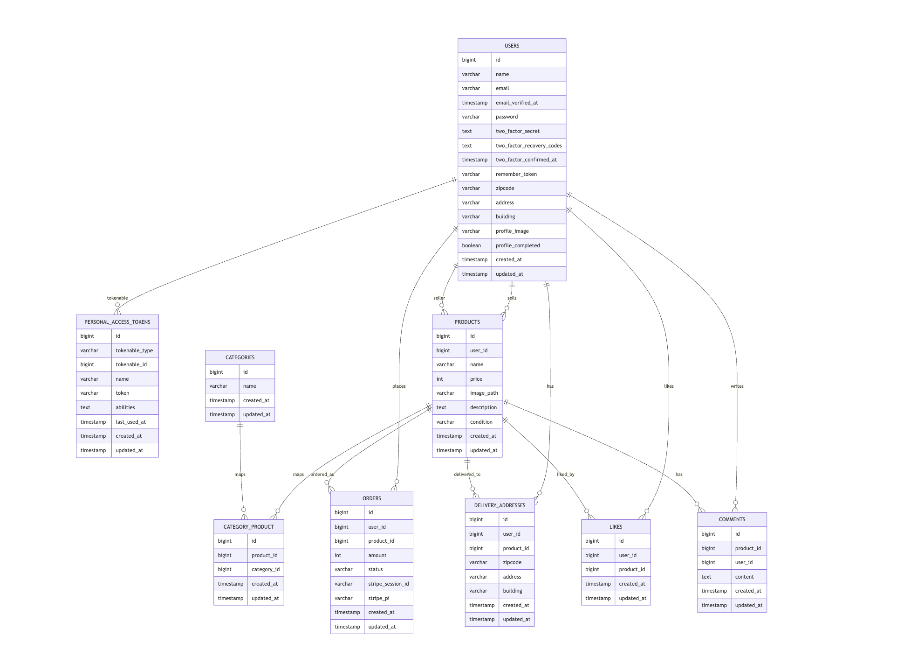

#模擬案件１

## 環境構築
Dockerのビルド
1.git clone <https://github.com/konomin08/simulation-1.git>
  cd <simulation-1>
2.docker-compose build
3.docker-compose up -d

アプリケーションキーの作成
php artisan key:generate

マイグレーションの実行
1.php artisan migrate

シーディングの実行
1.php artisan db:seed

## 使用技術(実行環境)
・PHP: 8.x
・Laravel: 8.x
・MySQL: 8.x
・Docker: 19.x 以上
・Docker Compose: 1.27.x 以上

## ER図

## URL
・開発環境: http://localhost/
